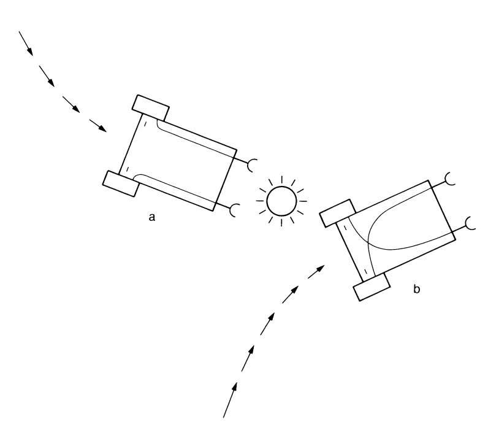
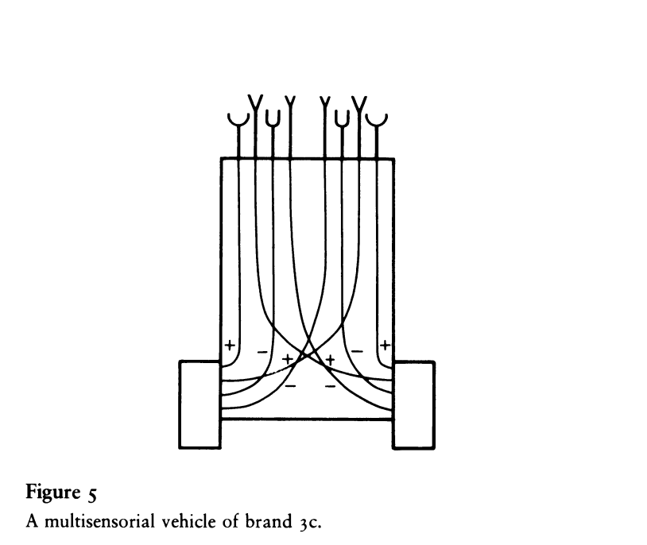

# Vehicle 3

The violence of Vehicle 2b, no less than the cowardice of its companion 2a, are traits that call for improvement. There is something very crude about a vehicle that can only be excited by the things it smells (or sees or feels or hears) and knows no soothing or relaxing stimuli. What comes to mind is to introduce some inhibition in the connections between the sensors and the motors, switching the sign of the influence from positive to negative. This will let the motor slow down when the corresponding sensor is activated. Again we can make two variants, one with straight and one with crossed connections (figure 4). Both will slow down in the presence of a strong stimulus and race where the stimulus is weak. They will therefore spend more time in the vicinity of the source than away from it. They will actually come to rest in the immediate vicinity of the source.

But here we notice a difference between the vehicle with straight connections and the one with crossed connections. Approaching the source, the first (figure 4a) will orient toward it, since on an oblique course the sensor nearer to the source will slow down the motor on the same side, producing a turn toward that side. The vehicle with straight connections will come to rest facing the source. The vehicle with crossed connections (figure 4b) for analogous reasons will come to rest facing away from the source and may not stay there very long, since a slight perturbation could cause it to drift away from the source. This would lessen the source's inhibitory influence, causing the vehicle to speed up more and more as it gets away.

You will have no difficulty giving names to this sort of behavior. These vehicles LIKE the source, you will say, but in different ways. Vehicle 3a LOVES it in a permanent way, staying close by in quiet admiration from the time it spots the source to all future time. Vehicle 3b, on the other hand, is an EXPLORER. It likes the nearby source all right, but keeps an eye open for other, perhaps stronger sources, which it will sail to, given a chance, in order to find a more permanent and gratifying appeasement.

But this is not yet the full development of Vehicle 3. We are now ready to make a more complete model using all the behavioral traits at our disposal. Call it Vehicle 3c. We give it not just one pair of sensors but four pairs, tuned to different qualities of the environment, say light, temperature, oxygen concentration, and amount of organic matter (figure 5). Now we connect the first pair to the motors with uncrossed excitatory connections, as in Vehicle 2a, the second pair with crossed excitatory connections, as in Vehicle 2b, and the third and the fourth pairs with inhibitory connections, crossed and uncrossed, as in Vehicles 3b and 3a.

This is now a vehicle with really interesting behavior. It dislikes high temperature, turns away from hot places, and at the same time seems to dislike light bulbs with even greater passion, since it turns toward them and destroys them. On the other hand it definitely seems to prefer a well-oxygenated environment and one containing many organic molecules, since it spends much of its time in such places. But it is in the habit of moving elsewhere when the supply of either organic matter or (especially) oxygen is low. You cannot help admitting that Vehicle 3c has a system of VALUES, and, come to think of it, KNOWLEDGE, since some of the habits it has, like destroying light bulbs, may look quite knowledgeable, as if the vehicle knows that light bulbs tend to heat up the environment and consequently make it uncomfortable to live in. It also looks as if it knows about the possibility of making energy out of oxygen and organic matter because it prefers places where these two commodities are available.

But, you will say, this is ridiculous: knowledge implies a flow of information from the environment into a living being or at least into something like a living being. There was no such transmission of information here. We were just playing with sensors, motors, and connections: the properties that happened to emerge may look like knowledge but really are not. We should be careful with such words. You are right. We will explain in a later chapter (on Vehicle 6) how knowledge may enter a system of connections. And we will introduce an alternative way of incorporating knowledge into the system in our chapter on Vehicle 7. In any case, once knowledge is incorporated, the resulting vehicle may look and behave quite like our Vehicle 3c.

Meanwhile I invite you to consider the enormous wealth of different properties that we may give Vehicle 3c by choosing various sensors and various combinations of crossed and uncrossed, excitatory and inhibitory, connections.

If you consider the possibility of strong and weak influences from the sensors to the motors, you realize that the variety becomes even greater. The vehicle may not care much about light but care very much about temperature. Its sense of smell may be much keener for organic matter than it is for oxygen or vice versa. And there may be many more than just four pairs of sensors and four sensory qualities: the vehicles may be equipped with all sorts of shrewd detectors of energy and of chemicals. But this is best discussed in connection with a new idea incorporated in the vehicles of the next chapter.

